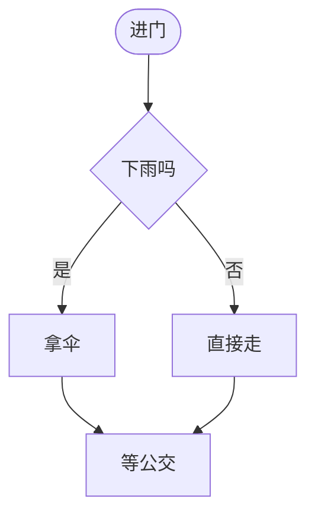
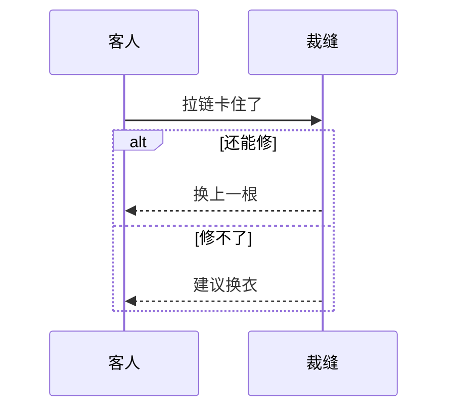
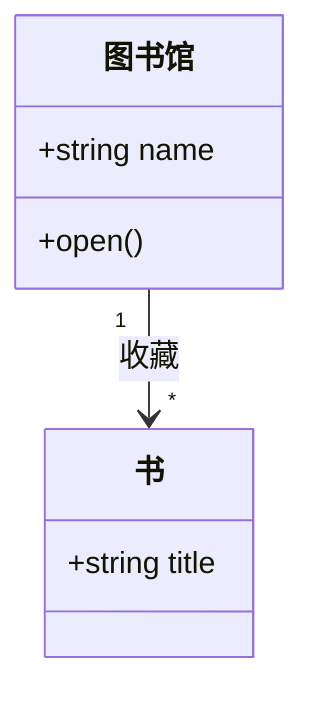
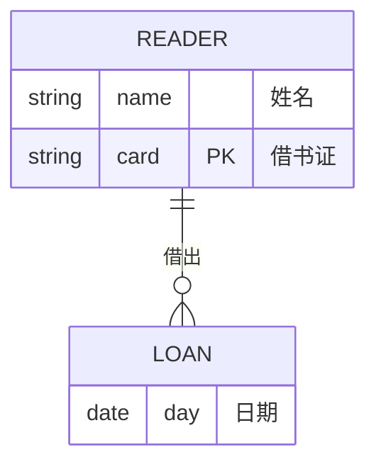
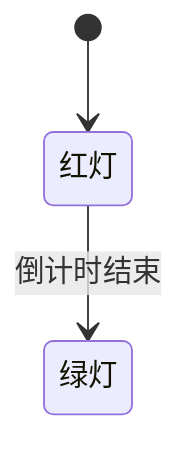
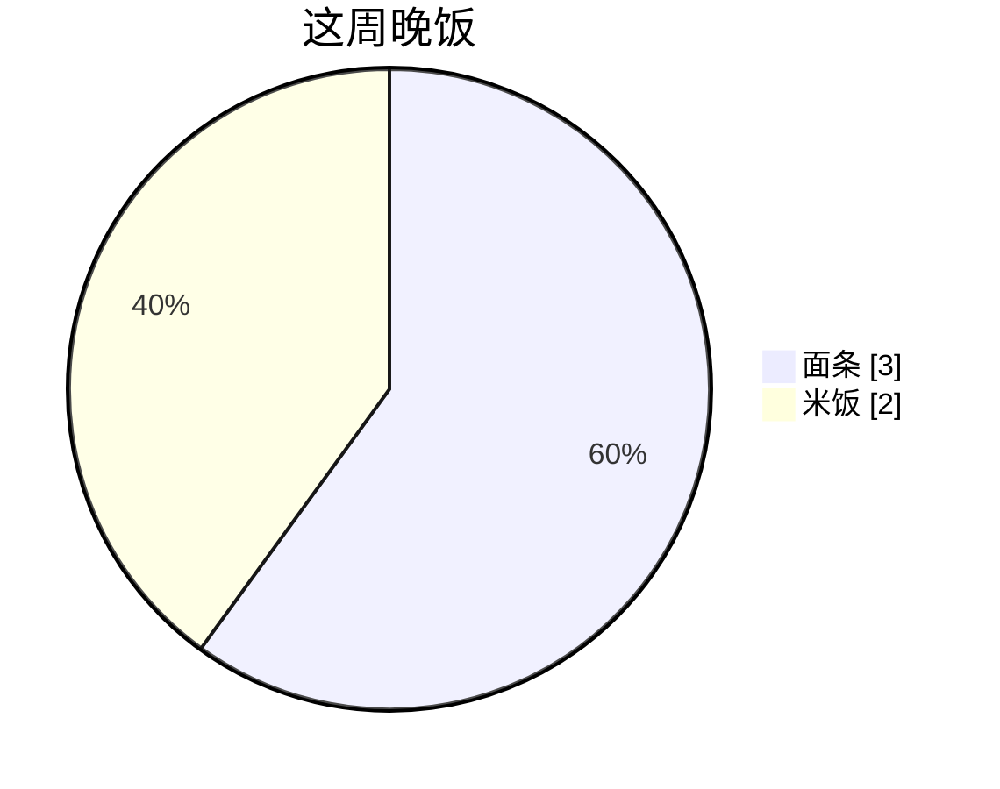
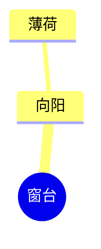

# Mermaid 图

问象把围栏正文交给 Mermaid 渲染。按标准语法写，一条语句一行。中文只放进展示文字，不放进标识符。

## 围栏

开头单独一行是 `` ```mermaid ``。下一行是图类型。每条语句单独一行。结尾单独一行是 `` ``` ``。

不要写成 `` ```mermaidflowchart ``，也不要把整张图粘成一行。不要写主题 frontmatter，不要在标签里写 HTML 或 `<br>`。配色由问象处理。

这一轮要求口语、禁止 Markdown（问书朗读、语音通话）时，不要输出围栏。

## 中文

标识符用英文或数字：节点 id、类名、实体名、状态 id、参与者 id。给人看的中文写在引号或别名里。

- 流程图：`Start["进门"]`，判断 `Check{"下雨吗"}`，边上 `-->|"是"|`
- 时序图：`participant Guest as 客人`，消息冒号后面可以直接写中文
- 类图：`class Library["图书馆"]`，关系标签写在冒号后面
- 关系图：实体名用英文大写，关系写成 `: "借出"`，属性注释写成 `string name "姓名"`
- 状态图：`state "红灯" as Red`
- 饼图：`"面条" : 3`，`title` 单独一行，可以用中文
- 思维导图：节点文字可以直接用中文

## 选哪种图

1. `flowchart`：步骤、判断、分支。方向用 `TD` 或 `LR`。
2. `sequenceDiagram`：按时间排列的来回消息。
3. `classDiagram`：类、成员、继承和组合。
4. `erDiagram`：实体、基数和属性。
5. `stateDiagram-v2`：状态怎么切换。
6. `pie`：占比。需要数字时写 `pie showData`。
7. `mindmap`：层级。用缩进表示从属。

一张图只讲一件事。

## 流程图

方向：`TD`、`LR`。节点形状写在 id 后面，文字放进引号。

- 矩形 `Step["处理"]`
- 圆角 `Start(["开始"])`
- 判断 `Check{"通过吗"}`
- 数据库 `Db[("库存")]`

连线：`-->`、`---`、`-.->`、`==>`。边上的字写成 `-->|"是"|`。相关步骤用 `subgraph` 包起来。



## 时序图

先声明参与者，再写消息。同步 `->>`，返回 `-->>`。分支用 `alt` / `else` / `end`。



## 类图

类名是英文 id，展示名写在引号里。成员每个一行。关系箭头整段写在一行：`<|--`、`*--`、`o--`、`-->`。基数写成 `"1"`、`"*"`。



## 关系图

一条关系一行。基数用 `||`、`|o`、`}o`、`}|` 和 `--`、`o{`。实体块里每个属性一行。



## 状态图

用 `stateDiagram-v2`。展示名用 `state "中文" as Id`。一条迁移一行。



## 饼图和思维导图




